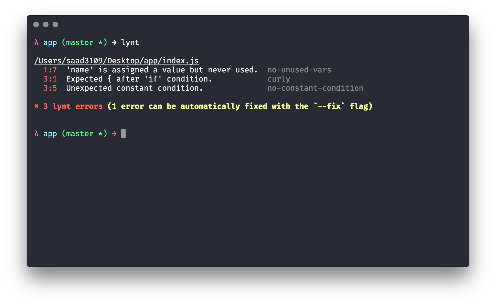

<h1 align="center">
	
</h1>

> A zero config JavaScript linter with support for React, Flow, and Typescript.

[](https://travis-ci.org/saadq/lynt)
[](https://spectrum.chat/lynt)

Lynt has two main philosophies:

1.  **Zero configuration**. Whether you're using React, Flow, TypeScript, you don't need to worry about configuring big `.rc` files or managing parsers, tool-specific rules, etc. It just works :)
2.  **No style rules**. Lynt is completely unopinionated when it comes to code style. It doesn't care whether or not you use semicolons, tabs or spaces, trailing commas, etc. Lynt only handles the error checking side of things and it leaves code style up to better-suited tools like [`prettier`](https://github.com/prettier/prettier).

---

> The real value of ESLint is in the non-style rules that prevent common errors.
>
> – Nicholas C. Zakas, the creator of ESLint.

---

## How It Works

Under the hood, Lynt uses [ESLint](https://github.com/eslint/eslint) and [TSLint](https://github.com/palantir/tslint) to lint your files.

It will know which linter to use as well as which rules/parsers/ignores/etc to apply based on the options you pass to it.



## Installation
Make sure you have [node](https://nodejs.org/en/) and [npm](https://www.npmjs.com/) installed first.

You can install the package locally for a single project:

```bash
$ npm install lynt --save-dev
```

Or you can install it globally (not recommended):

```bash
$ npm install lynt --global
```

## Usage

If you want to lint all your project files, you can just run the `lynt` command by itself.

Add a script to your `package.json`:

```json
{
  "scripts": {
    "lint": "lynt"
  }
}
```

And then run the script in your terminal whenever you want to lint your code:

```bash
$ npm run lint
```

By default, folders like `dist` and `node_modules` are ignored.

If you only want to lint a subset of your project or individual files, you can pass globs:

```json
{
  "scripts": {
    "lint": "lynt src/**/*.js"
  }
}
```

You can use flags to add support for Flow, React, or TypeScript. For example, if you were using TypeScript and React, you can set your `lint` script to:

```json
{
  "scripts": {
    "lint": "lynt --typescript --react"
  }
}
```

You can see a full list of flags you can pass to `lynt` in the [CLI](#cli) section.

## Notes on TypeScript Usage

Lynt uses TSLint to lint TypeScript files, and some TSLint rules require type information about your project in order to work. If your `tsconfig.json` file is in your root project folder, simply running

```bash
$ lynt --typescript
```

is enough. If your `tsconfig.json` file is elsewhere (for example, `./config/tsconfig.json`, you can point to it with a `--project` flag.

```bash
$ lynt --typescript --project config
```

Note that if you only choose to lint a subset of your project by doing something like this:

```bash
$ lynt src/index.ts --typescript
```

You will be opting-out of some of the lint rules that require type information. You cannot lint a subset of your project and still specify a `--project` at the same time.

One other thing to note is that the `--env` and `--global` flag are not supported with `--typescript`, though you shouldn't really need them as things like globals should be set with type declaration files.

Lastly, just remember that if you have `lynt` installed globally and are trying to use it with `--typescript`, you will need to make sure that you have `typescript` installed globally as well.

## CLI

```
  Usage
    $ lynt [files] <options>

  Options
    --typescript   Add support for TypeScript.
    --flow         Add support for FlowType.
    --react        Add support for React.
    --ignore       Glob patterns for paths to ignore.
    --fix          Automatically fix linting issues.
    --global       Add support for a given global variable.
    --env          Add support for a given environment.
    --json         Get lint results in JSON format instead of default "stylish" format.
    --project      Specify your project's main directory if it isn't in the root (only use with --typescript).

  JavaScript Examples
    $ lynt
    $ lynt --react
    $ lynt --react --flow --env jest
    $ lynt src
    $ lynt src --ignore out/**/*.* --ignore tests/**/*.*
    $ lynt src --global chrome --global atom

  TypeScript Examples
    $ lynt --typescript
    $ lynt --typescript --react
    $ lynt --typescript --project .
    $ lynt src --typescript
    $ lynt src --typescript --ignore out/**/*.* --ignore tests/**/*.*
```

## Settings

There are three ways you can specify your settings for Lynt:

1. Use CLI flags:

```bash
$ lynt --typescript --react --ignore tests/**/*.* --ignore fixtures/**/*.*
```

2. Have a `"lynt"` property in your `package.json` like so:

```json
{
  "lynt": {
    "typescript": true,
    "react": true,
    "ignore": ["tests/**/*.*", "fixtures/**/*.*"]
  }
}
```

3. Have a `.lyntrc` file in your root project folder:

```json
{
  "typescript": true,
  "react": true,
  "ignore": ["tests/**/*.*", "fixtures/**/*.*"]
}
```

## API

```ts
import lynt, { format } from 'lynt'
```

or

```js
const { default: lynt, format } = require('lynt')
```

### lynt(files[, options]) => LyntResults

> Uses ESLint or TSLint to lint a given set of files. Returns an array of LyntResult objects (see below to see its properties).

* **files** – A string or array of strings of file paths to lint. **Required**.
* **options** – A configuration object that lets you customize how lynt works. **Optional**

Here are the possible options you can pass:

```ts
{
  typescript?: boolean
  flow?: boolean
  react?: boolean
  ignore?: string | Array<string>
  fix?: boolean
  global?: string | Array<string>
  env?: string | Array<string>
  json?: string | Array<string>
  project?: string
}
```

See the [CLI](#cli) section to see a detailed description of what each option is for.

**Example** (no options):

```ts
import lynt from 'lynt'

const results = lynt(['foo.js', 'bar.js'])
console.log(results)
```

**Example** (with options):

```ts
import lynt from 'lynt'

const options = {
  flow: true,
  react: true
}

const results = lynt(['foo.js', 'bar.js'], options)
console.log(results)
```

**LyntResult Example**:

```ts
{
  filePath: string
  errors: Array<{
    ruleName: string
    message: string
    line: number
    column: number
    endLine?: number
    endColumn?: number
  }>
  errorCount: number
  fixCount: number
}
```

### format(lintResults) => string

> Formats an array of LyntResult objects (like the one returned from calling `lynt()`) into a nice looking table.

* **lintResults** – An array of LyntResult objects.

**Example**:

```ts
import lynt, { format } from 'lynt'

const results = lynt(['foo.js', 'bar.js'])
const table = format(results)

console.log(table)
```

## FAQ

### Why not [`standard`](https://github.com/standard/standard) or [`xo`](https://github.com/xojs/xo)?

I think these are awesome projects, and I have been a user of both. I definitely drew a lot of inspiration from them – however, one the main philosophies of `lynt` was to be an error-checker, not a style guide. Both `standard` and `xo` are very opinionated when it comes to style. `xo` is actually configurable, so you can manually remove the style rules, but you may as well just use ESLint at that point. TypeScript and Flow are another major concern – trying to get either of these to work correctly with `standard` or `xo` can be a pain – with `lynt` it is seamless.

### Are the current rules set in stone?

While `lynt` is still in v0.X, the rules are considered to be tentative – there will probably be rules being added in and removed. Once Lynt reaches a point where most are happy with the rules, v1 will be released and rules will change a lot less often. New rules will be added as ESLint and TSLint introduce them though and will be introduced to Lynt as a major version upgrade. However, at no point will any style rules be accepted as part of `lynt`.

### How can I voice my opinion about some of the linting rules?

The best way would be to open up a GitHub issue and people will be able to chime in with their opinion.

### Are there any editor plugins?

Unfortunately, I haven't gotten around to trying to make any yet. I can definitely use some help in this department, so if anyone would like to try to make a plugin for their favorite editor it would be greatly appreciated! Also, please let me know if there's anything I can improve with the API in order to make editor integration easier.

## License

MIT
